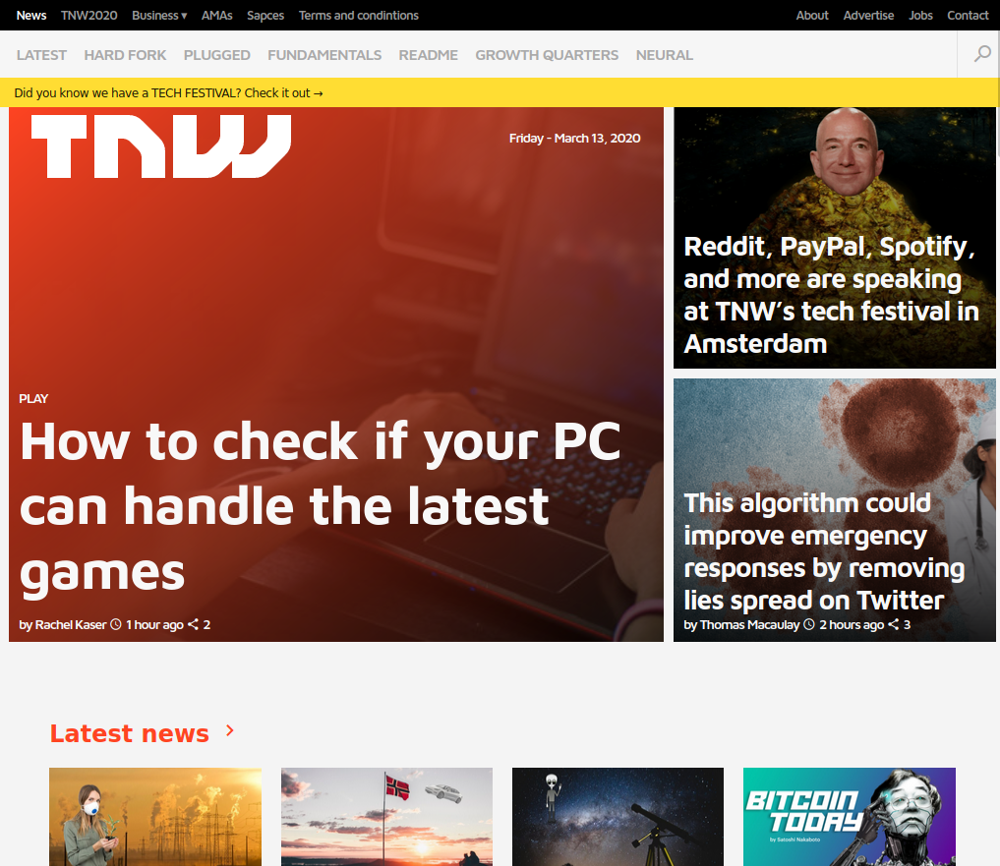

# Building with Responsive Design [Collaborative Project]

> This project takes a mobile first approach and consists of replicating the The Next Web website putting emphasis on how it behaves differently depending on the size of the screen where the website is rendered. [the next web website](https://thenextweb.com/).
> 

## Built With

- HTML,
- CSS,
- CSS positioning,
- Flexbox,
- CSS Grid

## Live Demo

[Live Demo Link](https://guirecordon.github.io/tnw-page-mockup/)

## Getting Started
Clone this repo on your local machine

### Prerequisites
To make this repository work on your local machine you need only a browser.

## Authors

👤 **Emmanuel Isabirye**

- Github: [@EmmanuelAaron](https://github.com/Emmanuelaaron)
- Twitter: [@EmmanuelAaron](https://twitter.com/EmmanuelIsabir1)
- Linkedin: [Emmanuel Isabirye](https://www.linkedin.com/in/fullstackwebdev-emma/)

👤 **Guilherme Recordon**

- Github: [@guirecordon](https://github.com/guirecordon)
- Twitter: [@RecordonG](https://twitter.com/RecordonG)
- Linkedin: [Guilherme Recordon](https://linkedin.com/gui-recordon-marketingmba/)

## 🤝 Contributing

Contributions, issues and feature requests are welcome!

Feel free to check the [issues page](https://github.com/guirecordon/tnw-page-mockup/issues).

## Show your support

Give a ⭐️ if you like this project!

## Acknowledgments

- Great Thanks to Microverse and the Odin project.

